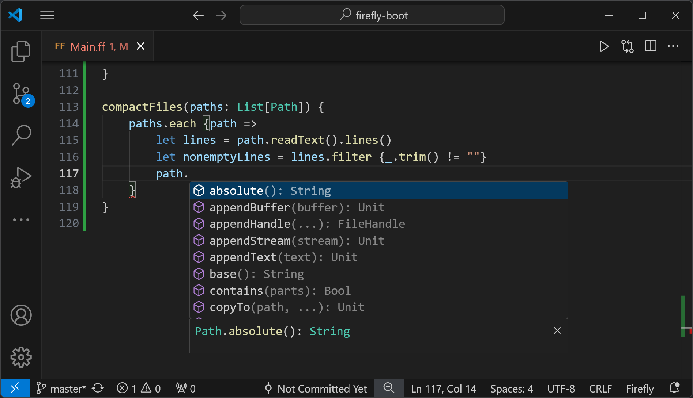

# Sections - this is a section heading

A sections has this type

```firefly
data Section(heading: String) {
    Section(
        blocks: List[Block]
    )
    SplitSection(
        first: Block
        second: Block
    )
}
```

`SplitSection` is not supported in the markdown format. Here is the type of block.


# Blocks

`CodeBlock`

```firefly
data Block {
    Paragraph(inlines: List[Inline])
    Bullets(items: List[List[Inline]])
    CodeBlock(code: String, firefly: Bool = False)
    Image(url: String)
    Video(url: String)
    LuxDemo(demo: String)
}
```

`Paragraph`

Well, just write some text...

`Bullets`

- Foo
- Bar
baz

`Image`



`Video`

The same as image, detect by file extension.

`LuxDemo`

Not supported yet

# Inline elements

```firefly
data Inline {
    Text(text: String)
    Bold(text: String)
    Italic(text: String)
    Code(code: String, firefly: Bool = False)
    Link(text: String, url: String)
    Anchor(heading: String, title: Option[String] = None)
}
```

Text with **bold** and _italic_.

Inline `code`. 

An anchor to this site [See blocks here](#blocks)

An [s](asdasd)anchor to another site [See blocks here](#blocks)

An e